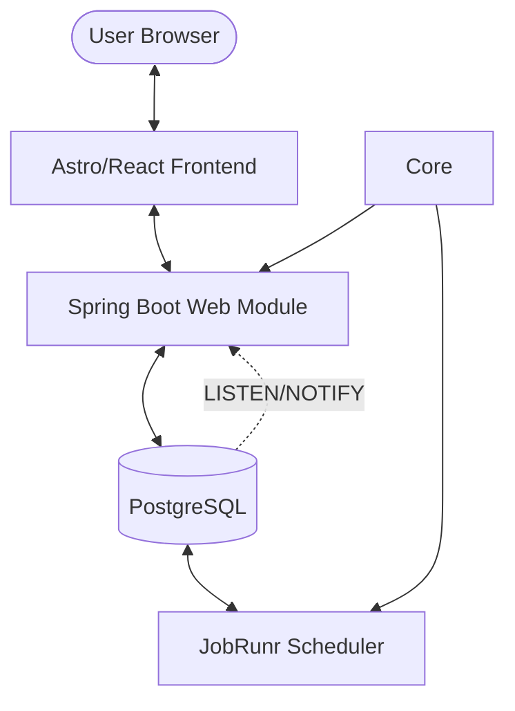

# 🌀 Fibonacci Universe

> [!NOTE]
> This README was autogenerated by Junie on 2026-01-23.

[](https://openjdk.org/projects/jdk/25/)
[](https://spring.io/projects/spring-boot)
[](https://astro.build/)
[](https://react.dev/)
[](https://www.docker.com/)

A high-performance, full-stack application for calculating, persisting, and streaming Fibonacci sequences in real-time. This project serves as a showcase for modern technologies including **Java 25 (Project Loom)**, **Spring Boot 4**, **Astro 5**, and real-time streaming via **SSE** and **WebSockets**.

## 📖 Table of Contents

- [Overview](#-overview)
- [Architecture](#-architecture)
- [Project Structure](#-project-structure)
- [Quick Start](#-quick-start)
- [Mathematics & Algorithms](#-mathematics--algorithms)
- [Tech Stack](#-tech-stack)

## 📖 Overview

The Fibonacci Universe is designed to handle massive Fibonacci computations efficiently. It leverages a multi-module Java backend for high-throughput calculations and a modern, reactive frontend to visualize the data stream. Key features include:

- **Distributed Computation**: Background tasks managed by JobRunr.
- **Real-time Streaming**: Choice between Server-Sent Events (SSE) and WebSockets (STOMP).
- **Reactive UI**: Built with Astro and React for optimal performance and developer experience.
- **Modern Java**: Utilizing Virtual Threads (Loom) for efficient concurrency.

## 🏗 Architecture



The system uses a **Producer-Consumer** pattern for calculations. The `web` module receives requests, the `scheduler` module processes them in the background using the `core` library, and the results are streamed back to the `client` via reactive channels.

## 🏗 Project Structure

- **[`java/`](./java/)**: The heart of the application.
    - `core`: Pure Java implementation of Fibonacci algorithms.
    - `scheduler`: Background task management and database persistence.
    - `web`: REST API, SSE/WebSocket streaming, and application entry point.
- **[`client/`](./client/)**: Modern web dashboard built with Astro, React, and Tailwind CSS.
- **[`http/`](./http/)**: Collection of `.http` files and scripts for API testing and H2C demonstration.
- **[`docker-compose.yaml`](./docker-compose.yaml)**: One-click infrastructure setup (Postgres).

## 🚀 Quick Start

### 1. Infrastructure
Ensure you have Docker installed, then start the database:
```bash
docker-compose up -d
```

### 2. Backend
Requires Java 25 and Maven.
```bash
cd java
./mvnw clean install
./mvnw -pl web spring-boot:run
```

### 3. Frontend
Requires Node.js 20+.
```bash
cd client
npm install
npm run dev
```
Visit `http://localhost:4321` to see the magic happen.

## 🧬 Mathematics & Algorithms

The project supports multiple calculation strategies to handle various input sizes:

| Algorithm | Complexity | Best For |
| :--- | :--- | :--- |
| **Fast Doubling** | $O(\log n)$ | Large indices ($n > 10,000$) |
| **Iterative** | $O(n)$ | Medium indices |
| **Recursive** | $O(2^n)$ | Educational purposes (slow!) |

The sequence is defined as $F_n = F_{n-1} + F_{n-2}$ with $F_0 = 0, F_1 = 1$.

## 🛠 Tech Stack

### Backend
- **Java 25**: Virtual Threads, Pattern Matching, Sealed Classes.
- **Spring Boot 4**: Native support for Java 25.
- **PostgreSQL**: Used as both a relational store and a message broker via `LISTEN/NOTIFY`.
- **JobRunr**: For reliable background job execution.

### Frontend
- **Astro 5**: Islands architecture for fast-loading UI.
- **React 19**: Modern hooks and concurrent rendering.
- **Tailwind CSS 4**: Utility-first styling with the latest features.
- **DaisyUI**: Component library for a polished look.


