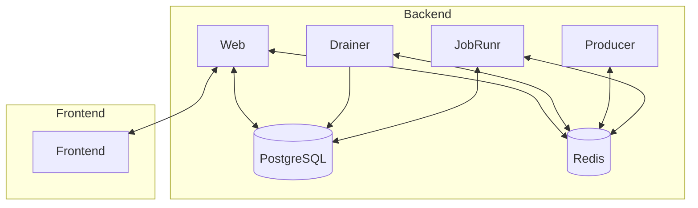

# Fibonacci Java

Distributed computing Fibonacci sequence generator created in Java.

#### Drawbacks with a Distributed workflow

- Operational complexity.
- Ordering of the sequence. Since it needs to be put in the stream in the same order as the Fibonacci sequence.
- Latency and partial failure.
- Race conditions.

#### Pros with a Distributed workflow

- Unlimited scalability.
- High availability.
- Separation of concerns.
- Straightforward to release new versions.

### Modules

#### Process modules

- `producer`: producer component that generates Fibonacci sequences and sends them to the queue. (headless)
- `scheduler`: scheduler component that pulls messages from the queue and computes the Fibonacci number and add it to a
  zset. (headless)
- `drainer`: drains the zset and add it to a Redis stream. (headless)
- `web-api`: web api component that exposes the Fibonacci numbers via REST and SSE. (web server)

#### Code modules

- `redis` : Everything redis related.
- `redis-test`: Test module for Redis.
- `postgres` : Everything Postgres related.
- `postgres-test`: Test module for Postgres.
- `shared` : Code shared between modules.

## Arrow Diagram

