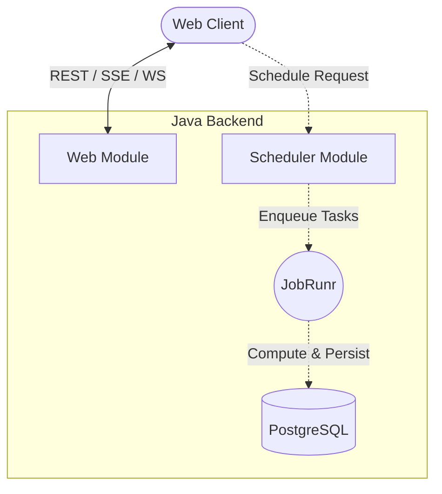

# ☕ Java Server Ecosystem

[](https://openjdk.org/projects/jdk/25/)
[](https://spring.io/projects/spring-boot)
[](https://openjdk.org/projects/loom/)
[](https://www.postgresql.org/)

The Java backend serves as the high-performance backbone of the Fibonacci project. It is engineered to handle intensive mathematical computations through a distributed, reactive architecture. This implementation leverages **Java 25's Virtual Threads (Project Loom)** for efficient concurrency and **Spring Boot 4** for a robust service framework.

---

## 🏗 Modular Architecture

The project is structured as a Maven multi-module system to ensure separation of concerns and scalability:

*   **[Core Module](./core)**: A zero-dependency, pure Java library containing optimized Fibonacci algorithms.
*   **[Scheduler Module](./scheduler)**: Manages distributed task execution and asynchronous persistence using **JobRunr**.
*   **[Web Module](./web)**: The communication gateway, providing RESTful APIs and real-time streaming via **SSE** and **WebSockets**.

### 🔄 System Data Flow



---

## 🚀 Getting Started

### Prerequisites
- **JDK 25** or higher.
- **Maven 3.9+**.
- **Docker** (for infrastructure services).

### Infrastructure Setup
Launch the PostgreSQL database and required infrastructure:
```bash
docker-compose up -d
```

### Build and Execution
Build the entire project from the root:
```bash
mvn clean install
```

Run the application (Web module is the entry point):
```bash
mvn -pl web spring-boot:run
```

---

## 🚢 Deployment Strategies

### Docker Integration
The project is container-ready. To build images and deploy the full stack:
1. Compile the artifacts: `mvn clean package`
2. Orchestrate services: `docker-compose up -d`

| Service | Endpoint |
| :--- | :--- |
| **Web API** | `http://localhost:8080` |
| **Scheduler API** | `http://localhost:8081` |
| **JobRunr Dashboard** | `http://localhost:8000` |

### Kubernetes (Minikube)
For cloud-native environments, we provide comprehensive Kubernetes manifests:
- **Initialization**: `./minikube-start.sh`
- **Deployment**: `./minikube-deploy.sh`
- **Cleanup**: `./minikube-delete.sh`

---

## 🧬 Mathematics & Computation

The backend supports multiple algorithmic strategies to balance precision and performance:

| Algorithm | Complexity | Capacity |
| :--- | :--- | :--- |
| **Fast Doubling** | $O(\log n)$ | Optimized for large-scale indices ($n > 10^5$). |
| **Iterative** | $O(n)$ | Efficient for standard ranges. |
| **Recursive** | $O(2^n)$ | Educational reference; not recommended for $n > 40$. |

---

## 🛠 Technology Stack

- **Runtime**: Java 25 (Virtual Threads).
- **Framework**: Spring Boot 4.0.2.
- **Persistence**: PostgreSQL (RDBMS + Message Broker).
- **Background Jobs**: JobRunr.
- **Real-time**: SSE, STOMP over WebSockets.


