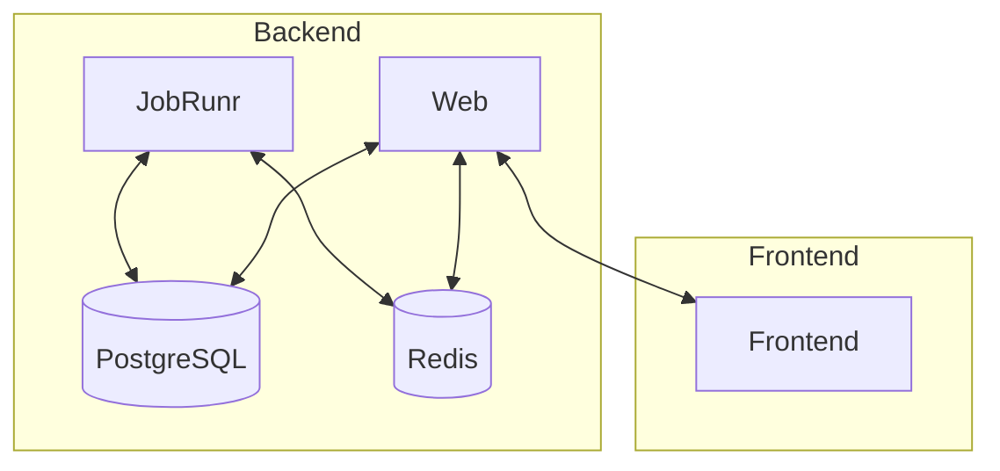

# Fibonacci Java

Distributed computing Fibonacci sequence generator created in Java.

#### Drawbacks with a Distributed workflow

- Operational complexity.
- Stream timeline synchronization. Ensuring that the stream maintains the correct order of Fibonacci sequences is crucial for accurate results.
- Latency and partial failure.
- Race conditions.

#### Pros with a Distributed workflow

- Unlimited scalability.
- High availability.
- Separation of concerns.
- Straightforward to release new versions.

### Modules

#### Process modules

- `jobrunr`: jobrunr scheduler service that can act as a producer node, worker node or both. (headless)
- `web-api`: web api component that exposes the Fibonacci numbers via REST and SSE, uses the Redis stream (web server)

#### Code modules

- `redis` : Everything redis related.
- `redis-test`: Test module for Redis.
- `postgres` : Everything Postgres related.
- `postgres-test`: Test module for Postgres.
- `shared` : Code shared between modules.

## Arrow Diagram

