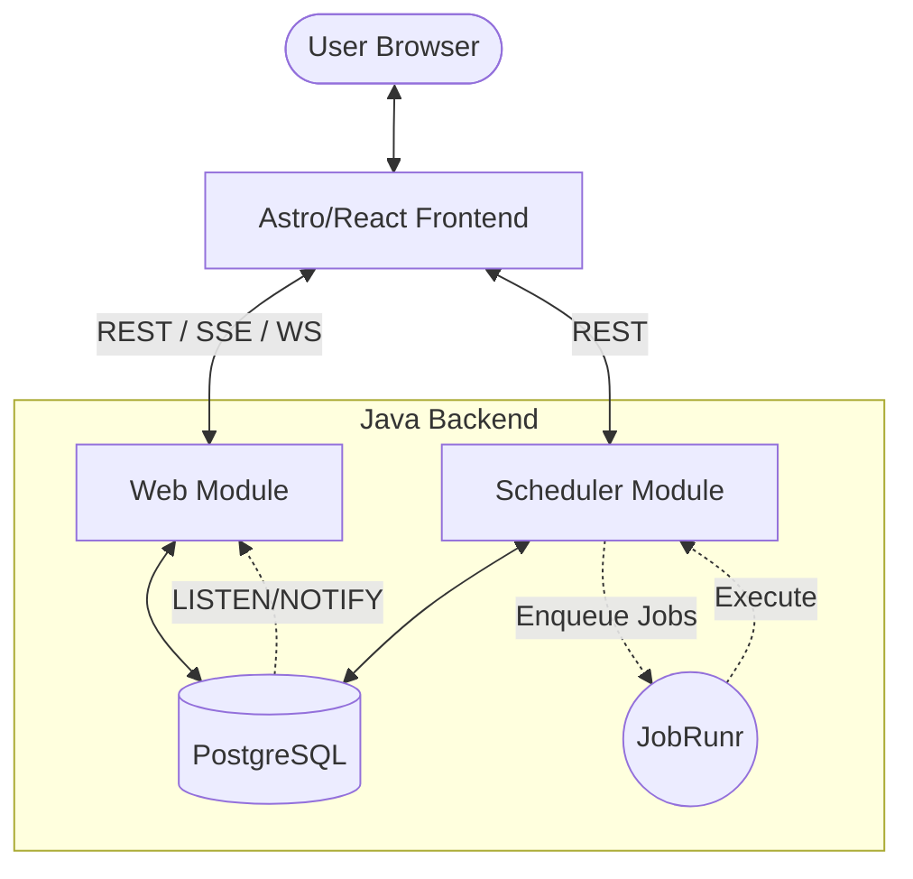

# 🌀 Java Server

> [!NOTE]
> This README was updated on 2026-01-24.

[](https://openjdk.org/projects/jdk/25/)
[](https://spring.io/projects/spring-boot)
[](https://astro.build/)
[](https://react.dev/)
[](https://www.docker.com/)

A high-performance, full-stack application for calculating, persisting, and streaming Fibonacci sequences in real-time. This project serves as a showcase for modern technologies including **Java 25 (Project Loom)**, **Spring Boot 4**, **Astro 5**, and real-time streaming via **SSE** and **WebSockets**.

## 📖 Table of Contents

- [Overview](#-overview)
- [Architecture](#-architecture)
- [Project Structure](#-project-structure)
- [Quick Start](#-quick-start)
- [Deployment](#-deployment)
    - [Docker Compose](#-docker-compose)
    - [Minikube (Kubernetes)](#-minikube-kubernetes)
- [Mathematics & Algorithms](#-mathematics--algorithms)
- [Tech Stack](#-tech-stack)

## 📖 Overview

The Java backend is designed to handle massive Fibonacci computations efficiently. It leverages a multi-module architecture for high-throughput calculations and real-time streaming. Key features include:

- **Distributed Computation**: Background tasks managed by JobRunr.
- **Real-time Streaming**: Choice between Server-Sent Events (SSE) and WebSockets (STOMP).
- **Reactive UI**: Built with Astro and React for optimal performance and developer experience.
- **Modern Java**: Utilizing Virtual Threads (Loom) for efficient concurrency.

## 🏗 Architecture



The Java architecture is modularized to separate concerns:
- **`web`**: Handles the communication layer (REST, SSE, WebSockets) and interfaces with the database for real-time notifications.
- **`scheduler`**: Manages background job enqueuing and execution via JobRunr, offloading heavy calculations.
- **`core`**: A pure Java library containing the mathematical algorithms for Fibonacci calculation.

## 🏗 Project Structure

- **[`java/`](./)**: The heart of the application.
    - [`core`](./core): Pure Java implementation of Fibonacci algorithms.
    - [`scheduler`](./scheduler): Background task management and database persistence.
    - [`web`](./web): REST API, SSE/WebSocket streaming, and application entry point.
- **[`client/`](../client/)**: Modern web dashboard built with Astro, React, and Tailwind CSS.
- **[`http/`](../http/)**: Collection of `.http` files and scripts for API testing.
- **[`docker-compose.yaml`](../docker-compose.yaml)**: One-click infrastructure setup (Postgres).

## 🚀 Quick Start

### 1. Infrastructure
Ensure you have Docker installed, then start the database:
```bash
docker-compose up -d
```

### 2. Run the Java Server
Requires Java 25 and Maven.
```bash
cd java
./mvnw clean install
./mvnw -pl web spring-boot:run
```

### 3. Run the Client
Requires Node.js 22+.
```bash
cd client
npm install
npm run dev
```
Visit `http://localhost:4321` to see the magic happen.

## 🚢 Deployment

### 🐳 Docker Compose

The easiest way to run the entire stack (PostgreSQL, Web, and Scheduler) is using Docker Compose.

1. **Build the JAR files**:
   ```bash
   ./mvnw clean package
   ```

2. **Start the services**:
   ```bash
   docker-compose up -d
   ```

The services will be available at:
- **Web API**: `http://localhost:8081`
- **Scheduler API**: `http://localhost:8080`
- **JobRunr Dashboard**: `http://localhost:8000`

### ☸️ Minikube (Kubernetes)

For a Kubernetes-based deployment, we provide a complete manifest and helper scripts for Minikube.

1. **Start Minikube**:
   ```bash
   ./minikube-start.sh
   ```
   *This starts Minikube with 4 CPUs and 8GB RAM and opens the dashboard.*

2. **Deploy to Kubernetes**:
   ```bash
   ./minikube-deploy.sh
   ```
   *This builds the JARs, loads images into Minikube, and applies `minikube-k8s.yaml`.*

3. **Access the Services**:
   Since the services are using `NodePort`, you can get the URLs via:
   ```bash
   minikube service list
   ```
   - **Web**: `http://<minikube-ip>:30081`
   - **Scheduler**: `http://<minikube-ip>:30080`
   - **JobRunr Dashboard**: `http://<minikube-ip>:30000`

4. **Cleanup**:
   ```bash
   ./minikube-delete.sh
   ```

## 🧬 Mathematics & Algorithms

The project supports multiple calculation strategies to handle various input sizes:

| Algorithm | Complexity | Best For |
| :--- | :--- | :--- |
| **Fast Doubling** | $O(\log n)$ | Large indices ($n > 10,000$) |
| **Iterative** | $O(n)$ | Medium indices |
| **Recursive** | $O(2^n)$ | Educational purposes (slow!) |

The sequence is defined as $F_n = F_{n-1} + F_{n-2}$ with $F_0 = 0, F_1 = 1$.

## 🛠 Tech Stack

### Backend
- **Java 25**: Virtual Threads, Pattern Matching, Sealed Classes.
- **Spring Boot 4**: Native support for Java 25.
- **PostgreSQL**: Used as both a relational store and a message broker via `LISTEN/NOTIFY`.
- **JobRunr**: For reliable background job execution.

### Frontend
- **Astro 5**: Islands architecture for fast-loading UI.
- **React 19**: Modern hooks and concurrent rendering.
- **Tailwind CSS 4**: Utility-first styling with the latest features.
- **DaisyUI**: Component library for a polished look.


