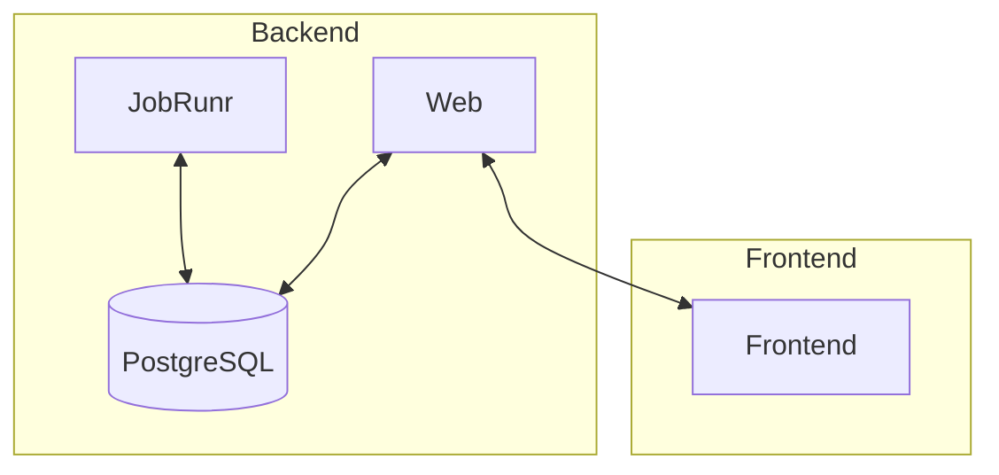

# Fibonacci Java

Distributed computing Fibonacci sequence generator created in Java.

### Workflow

Datapipeline is a distributed workflow that generates Fibonacci numbers using JobRunr as a processing engine.

#### Drawbacks with a Distributed workflow

- Operational complexity.
- Latency and partial failure.
- Race conditions.

#### Pros with a Distributed workflow

- Unlimited scalability.
- High availability.
- Separation of concerns.
- Straightforward to release new versions.

### API

The API exposes the Fibonacci numbers via REST, SSE and WebSockets through STOMP.

### Links

The application is exposing JobRunr dashboard and a swagger UI.

- [JobRunr dashboard] - (http://localhost:8000/) - Hosted from the web module
- [Swagger UI] - (http://localhost:8080/swagger-ui.html) - Hosted from the web module

### Modules

#### Process modules

- `jobrunr`: jobrunr scheduler service that can act as a producer node, worker node or both. (headless)
- `web`: web api component that exposes the Fibonacci numbers via REST and SSE (web server)

#### Code modules

- `postgres` : Everything Postgres related.
- `postgres-test`: Test module for Postgres.
- `shared` : Code shared between modules.

## Arrow Diagram

