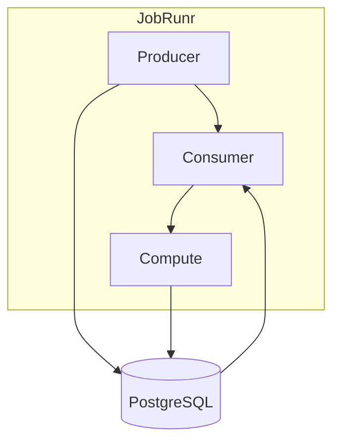

# JobRunr

This module acts as a job scheduler that can produce, consume, and compute Fibonacci numbers.
It can operate as a producer node, worker node, or both, depending on the configuration. It uses JobRunr as the
underlying job processing framework. For true node/server parallelism, JobRunr PRO is needed.

Change config for different modes.

- Producer
- Consumer

## Arrow Diagram

