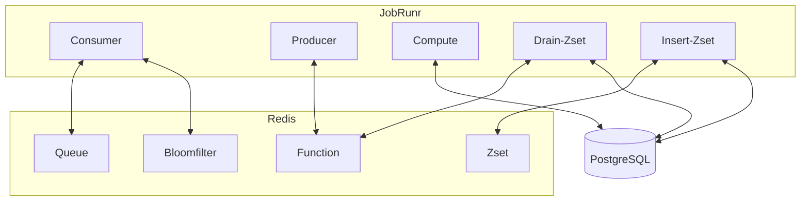

# JobRunr

This module acts as a job scheduler that can produce and consume messages, insert and drain the zset.
It can operate as a producer node, worker node, or both, depending on the configuration. It uses JobRunr as the
underlying job processing framework.

Change config for different modes.

- Producer
- Consumer
- Zset
    - Insert
    - Drain

## Arrow Diagram

